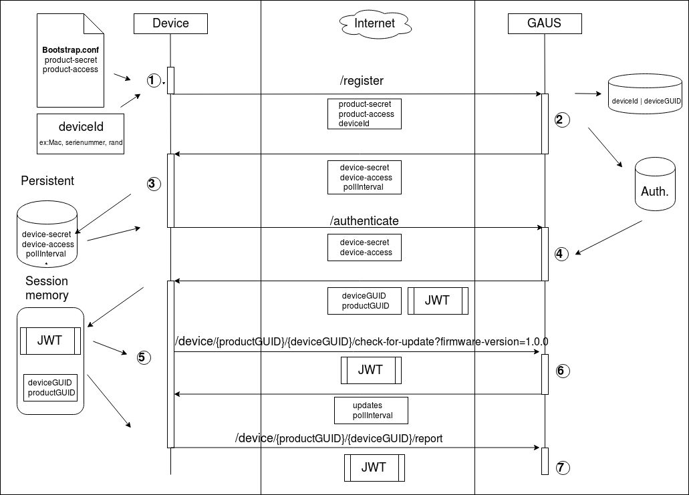

# GAUS client/backend overview

Name                            |  Stored in Device         |  Description
--------------------------------|---------------------------|------------------------------------------------------------------------------
productAuthParameters.accessKey | bootstrap.conf            | bootstrapped value for access to on-boarding for a specific product
productAuthParameters.secretKey | bootstrap.conf            | bootstrapped value for access to on-boarding for a specific product
deviceId                        | (somewhere in the device) | A device id that is unique identifier for the device that the device implementer choose, it could be MAC address, serial number, ...
deviceGUID                      | Session memory            | Backend generated GUID for tracking the device.
deviceAuthParameters.accessKey  | device.data               | Unique value for device to access the authentication API
deviceAuthParameters.secretKey  | device.data               | Unique value for device to access the authentication API
productGUID                     | Session memory            | Backend generated Id to track the product.
token                           | Session memory            | Backend generated [JWT](https://jwt.io/) token used to authenticate to the device API,
pollIntervalSeconds             | device.data               | Backend configuration that will be sent to update client when on-bording and optional when check-for-update.

1. The device makes the one time [register](../docs/register.md) call.
1. The backend will create a unique device accessKey and secretKey and return that to the device
1. The device needs to save the device accessKey and secretKey in persistent memory. The accessKey
 and secretKey will be used for doing an [authentication](../docs/authentication.md)
1. If the authentication was a success, the backend will return a [JWT](https://jwt.io/) token, productGUID and deviceGUID
1. The device will save this three values in the session memory. The [JWT](https://jwt.io/) token has a TimeToLive X h,
 then the device needs to redo the [authenticate](../docs/authentication.md). With the [JWT](https://jwt.io/) token, the device is now
 free to do [check-for-update](../docs/check-for-update.md) or [report](../docs/report.md)
1. Device will use the token, deviceGUID and productGUID to build up the URL to [check-for-update](../docs/check-for-update.md)
 If there are any updates, the backend will return them in a update manifest.
1. The [report](../docs/report.md) works as similar way as check-for-update API, but instead for asking for updates
 the device can post in data (metrics or events) to the backend.
